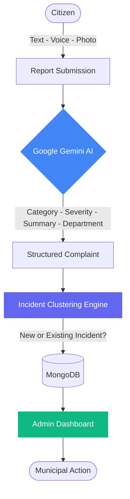
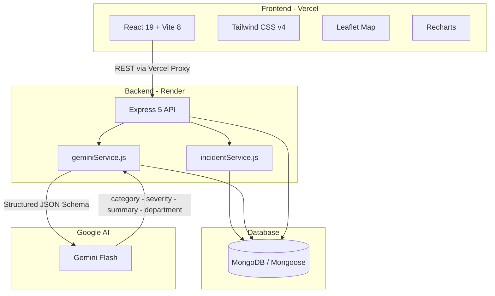
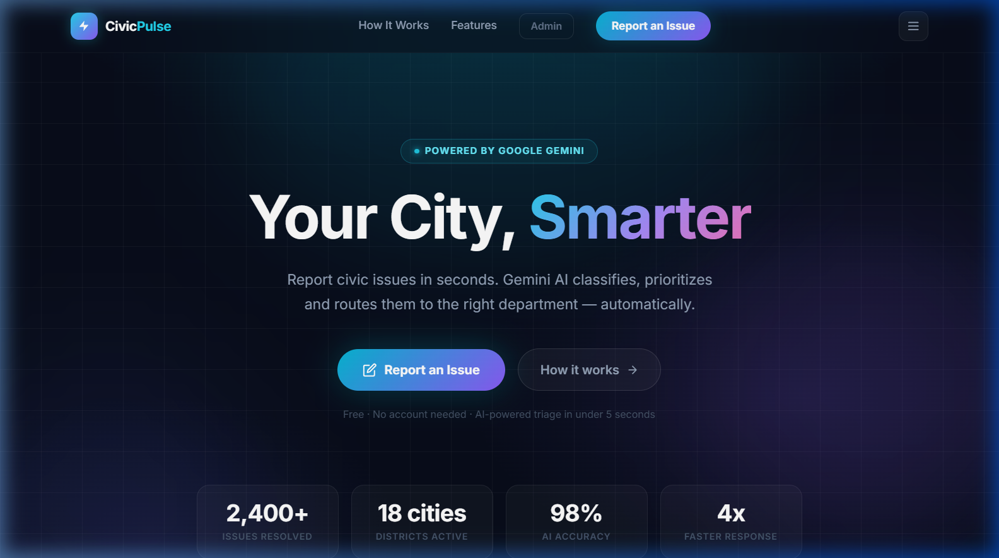
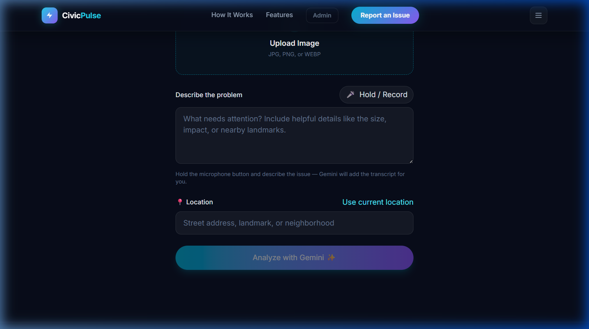
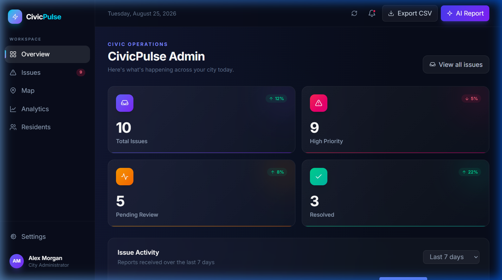

<div align="center">

<br />

# CivicPulse

### *From Citizen Reports to Civic Intelligence.*

**CivicPulse is an AI-powered civic issue platform that transforms unstructured citizen complaints into structured, actionable intelligence - analysed by Google Gemini, clustered into incidents, and surfaced on a real-time admin dashboard.**

<br />

[](https://civicpulse-swart.vercel.app/)
[](https://civicpulse-swart.vercel.app/)
[](https://react.dev/)
[](https://vitejs.dev/)
[](https://nodejs.org/)
[](https://expressjs.com/)
[](https://mongodb.com/)
[](https://ai.google.dev/)

<br />

</div>

---

## The Problem

Every day, citizens encounter problems that affect their quality of life.

| Category | Examples |
|---|---|
| Road and Infrastructure | Potholes, broken pavements, damaged bridges |
| Water and Drainage | Leaking pipes, blocked drains, water shortages |
| Sanitation and Waste | Uncollected garbage, open dumping, sewage overflow |
| Public Utilities | Broken streetlights, power failures, faulty signals |
| Public Safety | Hazardous sites, missing covers, unsafe conditions |

The real challenge is not simply collecting reports. Citizens describe problems in natural, unstructured language - a mix of text, voice, and images. Without intelligence applied at the point of submission, these reports pile up, lose urgency, get misrouted, and often go unaddressed.

> **The challenge is understanding unstructured information, identifying urgency, and transforming citizen observations into actionable civic intelligence.**

---

## The Solution

CivicPulse uses Google Gemini as an intelligence layer that reads every submission, understands context, extracts structure, and surfaces information that supports rapid response.



---

## How CivicPulse Works

```
01 - REPORT      The citizen submits an issue in plain text, voice, or by uploading a photo.
        |
        v
02 - ANALYSE     Google Gemini reads the report and extracts structured intelligence.
        |
        v
03 - STRUCTURE   Category, severity, summary, and suggested department are saved to MongoDB.
        |
        v
04 - CLUSTER     A keyword + geolocation engine groups related reports into shared Incidents.
        |
        v
05 - MONITOR     The Admin Dashboard presents all complaints, incidents, and AI reports live.
```

### Step 01 - Report

Citizens open the form and either type a description, **hold the microphone button to speak** (Gemini transcribes it), or upload a photo of the issue. Location can be typed manually or captured via the browser Geolocation API.

### Step 02 - Analyse

The moment a report is submitted, the backend calls Google Gemini with a structured prompt. Gemini returns a JSON object with four verified fields: `category`, `severity`, `summary`, and `suggestedDepartment`.

### Step 03 - Structure

The AI response is stored as a structured `Complaint` document in MongoDB, alongside the original description, optional image (base64), and GPS coordinates.

### Step 04 - Cluster

The `incidentService` immediately runs a clustering algorithm. It extracts keywords from the new complaint and searches open incidents of the same category. Two complaints are grouped into the same Incident if they share 35% or more keyword overlap **or** their GPS coordinates are within 250 metres of each other. If no match is found, a new Incident is created.

### Step 05 - Monitor

The Admin Dashboard (at `/admin`) pulls all complaints and incidents in real time, showing a live feed, interactive Leaflet map, Recharts analytics, severity breakdowns, and an on-demand AI Civic Report generated by Gemini from live database statistics.

---

## AI Intelligence - Powered by Google Gemini

CivicPulse uses Gemini not as a chatbot but as a **structured intelligence API**. Every call uses enforced JSON schema responses so the output is always machine-readable and reliable.

### Complaint Analysis - POST /api/ai/analyze

For every submitted complaint, Gemini returns:

| Field | Type | Description |
|---|---|---|
| `category` | `string` | Civic issue category (e.g. Roads, Sanitation, Utilities, Public Safety) |
| `severity` | `low` / `medium` / `high` / `critical` | Urgency level based on public impact |
| `summary` | `string` | A concise one-sentence summary of the complaint |
| `suggestedDepartment` | `string` | The municipal department that should handle the issue |

### Voice Transcription - POST /api/ai/transcribe

Citizens can hold the mic button and speak their complaint. The audio is recorded via the `MediaRecorder` API, encoded as a base64 data URL, and sent to Gemini which transcribes the spoken words directly into the description field.

### Photo Analysis - Combined with Complaint Text

When a citizen attaches a photo, the image is included in the Gemini prompt as inline multimodal data (base64). Gemini analyses both the text description and the image together before returning its structured response.

### AI Civic Report - POST /api/ai/report

Admins can generate an on-demand AI Civic Report. The backend computes live statistics from MongoDB (total complaints, most reported category, critical issue count, most affected area, recommended priorities) and sends them to Gemini, which returns a structured report used to populate the dashboard report modal.

---

## Key Features

| Feature | Description |
|---|---|
| Voice Reporting | Hold-to-record microphone input; Gemini transcribes speech to text in real time |
| Photo Attachment | Upload an image alongside a report; Gemini analyses both text and image together |
| AI Triage | Gemini categorises every complaint, assigns a severity, and suggests the handling department |
| Geolocation Capture | Browser Geolocation API captures precise GPS coordinates at submission |
| Incident Clustering | Related complaints are grouped into shared Incidents using keyword similarity and proximity matching |
| Admin Dashboard | Full-featured admin view at `/admin` with live feed, analytics, map, and status management |
| Interactive Map | Leaflet-powered map plots all geo-tagged complaints with colour-coded severity markers |
| Recharts Analytics | Bar and pie charts break down complaints by category and severity in the admin dashboard |
| AI Civic Report | On-demand Gemini-generated daily report summarising the live state of all civic complaints |
| Status Management | Admins can update complaint status: Pending, Assigned, In Progress, Resolved |
| RESTful API | Clean Express 5 REST API with full CRUD for complaints and dedicated AI endpoints |

---

## System Architecture



**Deployment:**
- **Frontend** - React + Vite, deployed to **Vercel**. API calls are proxied via `vercel.json` rewrites to the backend.
- **Backend** - Express 5 + Node.js, deployed to **Render**.
- **Database** - **MongoDB** accessed via Mongoose, storing `Complaint` and `Incident` documents.

---

## Tech Stack

### Frontend

| Technology | Version | Purpose |
|---|---|---|
| React | 19 | UI framework |
| Vite | 8 | Build tool and dev server |
| Tailwind CSS | 4 | Utility-first styling |
| Leaflet | 1.9.4 | Interactive complaint map (loaded via CDN) |
| Recharts | 2.15.1 | Admin analytics charts (loaded via CDN) |
| Inter (Google Fonts) | - | Typography |

### Backend

| Technology | Version | Purpose |
|---|---|---|
| Node.js | - | Runtime |
| Express | 5 | REST API framework |
| Mongoose | 9 | MongoDB ODM |
| CORS | - | Cross-origin requests |
| dotenv | - | Environment variable management |
| nodemon | - | Dev auto-restart |

### AI

| Technology | Purpose |
|---|---|
| Google Gemini Flash via @google/generative-ai | Complaint analysis, voice transcription, civic report generation |

### Database

| Technology | Purpose |
|---|---|
| MongoDB | Persistent storage for Complaints and Incidents |

### Deployment

| Platform | Role |
|---|---|
| Vercel | Frontend hosting with /api proxy rewrites |
| Render | Backend API hosting |

---

## Product Preview

### Homepage



### Report Form with AI Analysis



### Admin Dashboard



---

## Getting Started

### Prerequisites

- **Node.js** v18 or later
- **npm** v9 or later
- **MongoDB** instance (local or MongoDB Atlas)
- **Google Gemini API key** - [Get one free at Google AI Studio](https://aistudio.google.com/)

---

### 1. Clone the Repository

```bash
git clone https://github.com/your-username/civicpulse.git
cd civicpulse
```

### 2. Set Up the Backend

```bash
cd server
npm install
```

Create a `.env` file in the `server/` directory:

```env
PORT=5000
MONGO_URI=mongodb://127.0.0.1:27017/civicpulse
GEMINI_API_KEY=your_gemini_api_key_here
```

Start the backend development server:

```bash
npm run dev
```

The API will be available at `http://localhost:5000`.

### 3. Set Up the Frontend

```bash
cd ../client
npm install
```

Start the frontend development server:

```bash
npm run dev
```

The app will be available at `http://localhost:5173`.

> **Note:** In production, the Vercel proxy handles all `/api` routing to the Render backend automatically.

### 4. Open the App

| Route | Description |
|---|---|
| `http://localhost:5173/` | Public citizen-facing report form |
| `http://localhost:5173/admin` | Admin dashboard |

---

## Environment Variables

### server/.env

| Variable | Required | Description |
|---|---|---|
| `PORT` | No | Port for the Express server (default: 5000) |
| `MONGO_URI` | Yes | MongoDB connection string |
| `GEMINI_API_KEY` | Yes | Google Gemini API key from Google AI Studio |

---

## API Reference

### Complaints

| Method | Endpoint | Description |
|---|---|---|
| POST | `/api/complaints` | Submit a new complaint (triggers Gemini analysis + incident clustering) |
| GET | `/api/complaints` | Retrieve all complaints with populated Incident data |
| GET | `/api/complaints/:id` | Retrieve a single complaint by ID |
| PATCH | `/api/complaints/:id` | Update a complaint (e.g. change status) |
| DELETE | `/api/complaints/:id` | Delete a complaint |

### AI

| Method | Endpoint | Description |
|---|---|---|
| POST | `/api/ai/analyze` | Analyse a complaint description and optional image with Gemini |
| POST | `/api/ai/transcribe` | Transcribe a base64 audio recording using Gemini |
| POST | `/api/ai/report` | Generate an AI Civic Report from live database statistics |

### Health

| Method | Endpoint | Description |
|---|---|---|
| GET | `/api/health` | Check backend health status |

---

## Live Demo

<div align="center">

**Experience CivicPulse in action - no setup required.**

[](https://civicpulse-swart.vercel.app/)

Submit a civic complaint, watch Gemini analyse it in real time, and explore the Admin Dashboard at `/admin`.

</div>

---

## Future Scope

The following capabilities are **planned for future versions** and are not currently implemented:

- Multilingual support - Accept complaints in regional and local languages
- Advanced semantic duplicate detection - ML-based similarity beyond keyword matching
- Predictive civic analytics - Trend analysis and early-warning indicators by area and category
- Citizen accounts - Track personal submissions and receive status update notifications
- Push notifications - Alert citizens and officials when issue status changes
- Department portal - Separate views for each municipal department to manage assigned issues

---

## Project Vision

> *Most civic complaint platforms are digital suggestion boxes. CivicPulse is something different.*

CivicPulse is designed to move beyond simply collecting complaints and toward transforming citizen observations into structured civic intelligence. Every report that enters the system leaves as a structured, categorised, prioritised, geo-tagged, and clustered data point ready to support faster understanding and smarter action.

<div align="center">

```
From Citizen Reports
        |
        v
To Civic Intelligence
        |
        v
To Smarter Action
```

**Built with purpose at Hack Days Buxar.**

<br />

[](https://civicpulse-swart.vercel.app/)

</div>